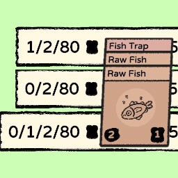

# Show Food Availability

Displays one or more additional food counters which do not include food placed on a Food Producer.

These counters indicate if the food on Food Producers will need to be used to feed villagers.

A Food Producer is a garden, farm, fishing trap, etc.

# Display Options

The food count can be "Food not the first item on a Food Producer" and/or "Food that is not part of a stack on a Food Producer".

By default, only the "Not in stack" value is added to the display, and the food text will change to orange if any enabled food counters is under the required food.

See [Settings](#settings) below.

The first 5 items on a Composter are excluded from both counts.

## Example

Given a board where there is only three Raw Fish as food and they are all on a Fish Trap, the counters would show as follows:

Display in game
0/2/3/999

|Counter|Value|Is regular game counter|
|--|--|--|
|Not in stack|0||
|Not first item on stack|2||
|Game's total Food|3|true|
|Food required to feed the Villagers|999|true|

# Settings

|Setting|Default|Description|
|--|--|--|
|ShowNotFirstFood|false|Shows the amount of food that is not the first card on a food consumer.  The first five items on a Composter are also excluded from this count.|
|ShowNotInStack|true|Shows the amount of food that is not on a food consumer at all.|
|ShowWarningColor|true|If true, the food text will be changed to an orange color if one of the enabled food counters are below the required food.|
|WarningMultiplier|1|The food warning multiplier.  For example, if the value is 2, the minimum food warning will be shown if the food is less than 2x the required food |

# Change Log

## 1.2
Added warning food multiplier.
## 1.1
Added food counter warning color and related configuration option.
